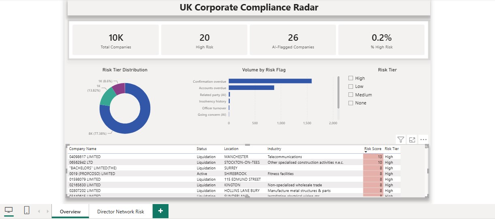
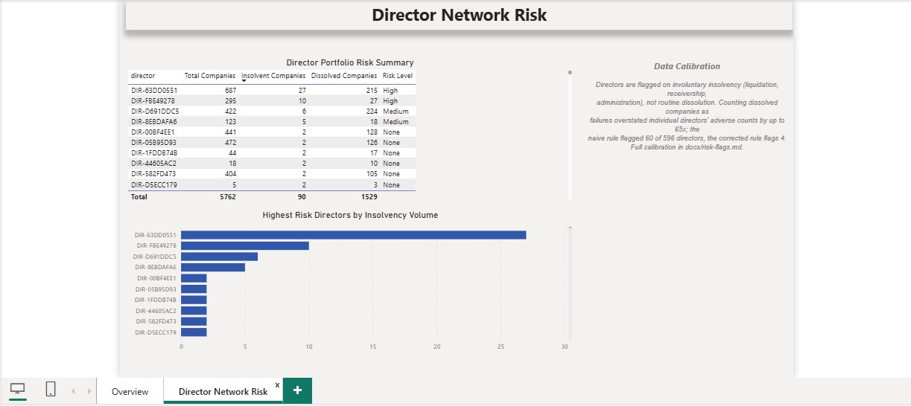

# Power BI Dashboard — UK Corporate Compliance Radar

An interactive, two-page compliance-triage dashboard built on the project's gold star schema. It turns 10,000 UK Companies House records and their computed risk flags into a ranked, explainable watchlist that a compliance analyst could actually work from.

The report is committed in the Git-friendly **`.pbip`** (Power BI Project) format, so the report layout and the semantic model are stored as readable JSON and TMDL text rather than a binary file. To open and edit it, use Power BI Desktop (`File > Open` the `.pbip`). If you don't have Power BI, the screenshots below show both pages.

> **Director names are pseudonymised.** Directors are personal data, so everything published here — screenshots, the committed semantic model, and the exported data behind it — shows deterministic aliases of the form `DIR-63DD0551` rather than real names. See [Data protection](#data-protection) below.

## Page 1 — Executive Overview

The headline view. Four KPI cards summarise the whole register, then the breakdown and the watchlist sit below.

- **KPI cards:** 10,000 companies assessed, **20 High Risk**, **26 AI-flagged**, and a **0.2%** high-risk rate.
- **Risk Tier Distribution (donut):** None 77.4%, Low 13.8%, Medium 8.6%, High 0.2%. Most of the register is low-risk, as expected; the value is in isolating the small high-risk tip.
- **Volume by Risk Flag (bar):** how often each flag fires across the register. The bulk register-wide flags (confirmation and accounts overdue) dominate by design; the enrichment-only flags (related party, insolvency history, officer turnover, going concern) are rarer because they depend on companies having been enriched.
- **Watchlist (table):** every company ranked by composite risk score, with conditional formatting on the score. This is the "what do I look at first" list, and each row's score traces back to the specific flags that produced it.
- **Risk Tier slicer:** clicking a tier filters every visual on the page at once.

**Reading the coverage split.** All 10,000 companies carry the bulk register flags (overdue accounts, overdue confirmation statement). The richer flags only fire on the enriched subset: 300 companies have live API enrichment, and 239 of those have AI-extracted flags read from their accounts. So the tier distribution across the full register is driven mostly by overdue filings; the network-risk and AI flags sharpen a small, deliberately-scoped slice. The 26 AI-flagged companies reconcile to 22 related-party plus 6 going-concern positives, with two companies carrying both.

## Page 2 — Director Network Risk

A drill-down into the director-network-risk flag, the analytical centrepiece of the project.

- **Director Portfolio Risk Summary (table):** directors ranked by the number of companies they are linked to that entered involuntary insolvency, alongside their total and merely-dissolved company counts. Directors appear as pseudonymous `DIR-` aliases.
- **Highest Risk Directors by Insolvency Volume (bar):** the top directors by insolvency exposure.
- **Data Calibration (note):** a short caption stating the key methodological decision — directors are flagged on *involuntary insolvency* (liquidation, receivership, administration, insolvency-proceedings, voluntary-arrangement), not routine dissolution. Conflating the two inflated individual directors' adverse-company counts by up to **65x** (one director: 130 "adverse" companies against only 2 true insolvencies). The full calibration story is in [`docs/risk-flags.md`](../docs/risk-flags.md), and it is reproducible on demand via [`transform/recalibrate_network.sql`](../transform/recalibrate_network.sql).

**How few directors actually flag.** Of the 596 active human directors assessed, only **4** cross the threshold — 2 High (10 or more insolvency links) and 2 Medium (5 to 9) — and they flag **3 of the 287 assessable companies**. The table is sorted by insolvency count, so the flagged directors sit at the top and everyone below them is correctly `None`. That sparseness is the point: the naive version of this rule flagged 60 directors and 50 companies, and the calibration is what reduced it to a set a person can actually review.

The top row illustrates the residual limitation the rule knowingly carries: a director linked to 687 companies with 27 insolvencies is flagged High on absolute count, but 27/687 is roughly 4% — near the register baseline, and the signature of an insolvency professional rather than a bad actor. A flagged director is a prompt for human review, never a conclusion.

## Data model

The dashboard sits on three tables exported from the gold layer (see [`transform/powerbi_export.sql`](../transform/powerbi_export.sql)):

| Table | Grain | Role |
|---|---|---|
| `company_risk` | one row per company (10,000) | fact + company attributes and all flags; the main table |
| `flags_long` | one row per (company, active flag) | unpivoted flags, powers the "flags firing" chart and per-flag filtering |
| `director_risk` | one row per scored director (596), pseudonymised | standalone table for the network-risk page |

`flags_long` relates to `company_risk` many-to-one on `company_number` (single cross-filter direction). `director_risk` is standalone. All heavy joining is done in SQL, so Power BI receives clean, report-ready tables and the model stays simple.

A handful of DAX measures drive the KPI cards: `Total Companies`, `High Risk`, `Medium Risk`, `% High Risk`, and `AI-Flagged Companies` (companies carrying a going-concern, auditor-resignation, or related-party flag from the LLM extraction layer).

## Data protection

Director records are personal data under UK GDPR, so the published artefacts are de-identified by construction rather than by redacting after the fact:

- Real names exist **only** in the local Postgres warehouse. They are never exported.
- The `director_risk` export is generated from a masked view (`gold.pbi_director_risk_masked`), which replaces each name with a deterministic alias — `'DIR-' || upper(substr(md5(officer_id || salt), 1, 8))` — and drops `officer_id` entirely. The same person always maps to the same alias, so directors stay traceable across dashboard versions without ever being identifiable.
- The salt is a secret held outside source control (a git-ignored `.env` locally; Azure Key Vault in a cloud deployment). This matters because `officer_id` values are public on Companies House: with a published salt the aliases could be brute-forced back to real ids.
- Company names and numbers are **not** masked — they are public register data, not personal data.

The design point: the tool works on real names internally, because an analyst needs to know who they are reviewing; the published demo is pseudonymised. Masking at the export layer rather than in Power Query means real names never enter the CSV, the semantic model, or a screenshot in the first place.

## Refreshing the report

The dashboard reads three CSVs exported from the warehouse. To refresh after a pipeline re-run:

1. On the machine running Postgres, rebuild the export views (`transform/powerbi_export.sql`), then export `company_risk.csv`, `flags_long.csv`, and the masked `director_risk.csv`.
2. Verify no real names escaped before the files leave the machine — every value in the `director` column should match `DIR-[0-9A-F]{8}`.
3. Open the `.pbip` in Power BI Desktop, confirm the three queries point at the export folder (Transform data → Data source settings), and Refresh.
4. Sanity-check the visuals against the source: enriched companies 300, AI-extracted 239, flagged directors 4, network-flagged companies 3.
5. Re-export both page screenshots to `Screenshots/` from the masked report.

The `.pbi/` cache folder and `*.pbix` files are git-ignored, so only the readable project files are committed.

## What this dashboard demonstrates

Every layer of the pipeline surfaces here in one place: rule-based flags (overdue filings, insolvency history, strike-off), the calibrated director-network-risk flag, and the AI-extracted flags read from PDF accounts, all feeding a single, transparent, additive risk score. The scoring is deliberately simple and hand-checkable, because a risk score a compliance team cannot explain is a risk score they will not trust. The same principle governs what the dashboard *doesn't* claim: the AI flags are shown as counts, not as accuracy figures, because precision and recall have not yet been measured on a labelled set at this scale.